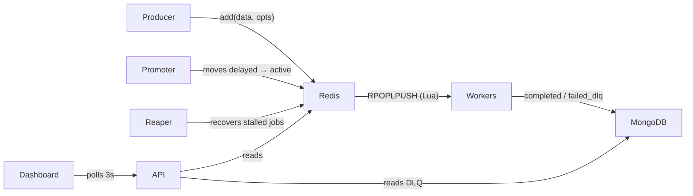
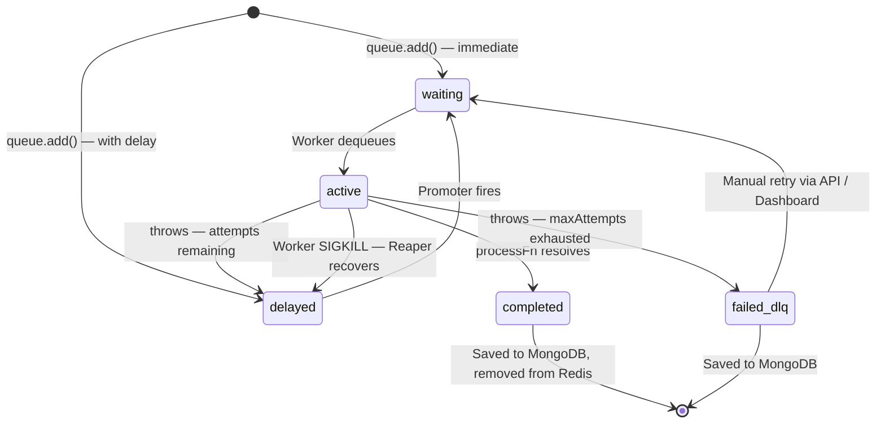

<div align="center">

# ⚡ PulseQueue

**A high-performance, Redis-backed job queue engine built from scratch in Node.js**

[](https://nodejs.org)
[](https://redis.io)
[](https://mongodb.com)
[](https://react.dev)
[](https://jestjs.io)
[](LICENSE)

> *Engineering a production job queue from first principles — no library wrappers, just Redis, Lua, and Node.js.*

</div>

---

## 🎯 Overview

PulseQueue is a production-grade job queue built without high-level abstractions. Every primitive — priority dequeuing, delayed scheduling, crash recovery, exponential backoff, and the Dead Letter Queue — is implemented directly on Redis data structures and atomic Lua scripts.

**Ships with:** a core engine (`Queue` + `Worker` + `Reaper`), an Express REST API, a React + Vite monitoring dashboard, a Jest integration test suite, and benchmark/chaos engineering tooling.

---

## 🚨 Problems Solved

| # | Problem | Solution |
|---|---------|----------|
| 1 | Two workers claiming the same job | Atomic `RPOPLPUSH` Lua script — race-free dequeue |
| 2 | Priority processing | Three Redis LISTs (`high` / `default` / `low`) checked in strict order |
| 3 | Worker crash mid-job | Heartbeat lock (TTL 30s) + **Reaper** detects expired locks and re-queues |
| 4 | Permanent job failures | Exponential backoff with jitter → **Dead Letter Queue** in MongoDB |
| 5 | Delayed job scheduling | Redis ZSET scored by Unix timestamp, polled by a **Promoter** |
| 6 | Graceful shutdown | `Promise.allSettled` drains in-flight jobs before disconnecting |

---

## ✨ Key Features

- 🚦 **Three-tier Priority Queue** — strict `high → default → low` processing via a single atomic Lua script
- 🕐 **Delayed Job Scheduling** — millisecond-precision scheduling with a Redis Sorted Set
- 🔐 **Distributed Heartbeat Locks** — 30s TTL locks renewed every 15s; dead workers release automatically
- 💀 **Crash Recovery (Reaper)** — background process re-queues jobs whose worker locks expired
- 🔁 **Exponential Backoff with Jitter** — `baseBackoff × 2^attempt + rand(0, 500ms)`
- 📭 **Dead Letter Queue** — failed jobs persisted to MongoDB for audit and one-click retry
- ⚡ **Configurable Concurrency** — N parallel loops per Worker instance
- 🛑 **Graceful Shutdown** — waits for in-flight jobs before disconnecting
- 📊 **Live Dashboard** — React UI with 3-second polling, queue switching, and DLQ retry

---

## 🛠 Tech Stack

| Layer | Technologies |
|-------|-------------|
| **Runtime** | Node.js 18+, CommonJS |
| **Job Store** | Redis 7+ via ioredis 6.x |
| **Persistence** | MongoDB 7+ via Mongoose 9.x |
| **API** | Express 5.x, CORS |
| **Atomicity** | Lua scripts embedded in Redis |
| **Dashboard** | React 19, Vite 8, Vanilla CSS |
| **Testing** | Jest 30, mongodb-memory-server 11 |

---

## 🏗 Architecture



### Job State Machine



---

## 📁 Folder Structure

```
PulseQueue/
├── src/
│   ├── queue.js                # Queue — add jobs, run delayed promoter
│   ├── worker.js               # Worker — dequeue, execute, retry, DLQ
│   ├── reaper.js               # Reaper — crash recovery via lock expiry
│   ├── api/routes.js           # Express REST API
│   ├── lua/
│   │   ├── dequeuePriority.lua # Atomic RPOPLPUSH priority chain
│   │   └── promoteDelayed.lua  # Atomic ZSET → LIST promotion
│   └── models/JobRecord.js     # Mongoose schema (completed / failed_dlq)
├── dashboard/                  # React + Vite monitoring UI
│   └── src/
│       ├── App.jsx             # Queue selector, tabs, auto-polling
│       ├── api.js              # Fetch wrappers
│       └── components/
│           ├── StatsBar.jsx    # Live job count cards
│           ├── JobTable.jsx    # Job list (waiting/delayed/processing)
│           └── DLQView.jsx     # DLQ table with retry buttons
├── tests/
│   ├── queue.test.js           # Core add/delay/promote tests
│   ├── worker.test.js          # Deduplication and priority ordering
│   ├── reliability.test.js     # Backoff, DLQ routing, Reaper recovery
│   └── lifecycle.test.js       # Concurrency limits and graceful shutdown
├── benchmark/
│   ├── loadtest.js             # Throughput and latency harness
│   ├── chaostest.js            # Worker crash / Reaper recovery simulation
│   └── loadtest_results.json   # Latest results
├── index.js                    # Standalone demo
├── server.js                   # API server entry point
└── populate.js                 # Queue seed script
```

---

## 🚀 Quick Start

**Prerequisites:** Node.js 18+, Redis 7+ on `localhost:6379`, MongoDB 7+ on `localhost:27017` *(optional)*

```bash
# 1. Install
git clone https://github.com/your-username/PulseQueue.git && cd PulseQueue
npm install && cd dashboard && npm install && cd ..

# 2. Start Redis (Docker)
docker run -d -p 6379:6379 redis:7-alpine

# 3. Start full stack (API + Dashboard concurrently)
npm run dev

# 4. (Optional) Seed the queue
node populate.js

# 5. (Optional) Run standalone demo
node index.js
```

| URL | Service |
|-----|---------|
| `http://localhost:3001` | Express REST API |
| `http://localhost:5173` | React Dashboard |

---

## 🔧 Environment Variables

| Variable | Default | Description |
|----------|---------|-------------|
| `PORT` | `3001` | API server port |
| `MONGO_URI` | `mongodb://localhost:27017/pulsequeue` | MongoDB connection string |

Redis defaults to `localhost:6379`. Pass `redisOptions` when constructing `Queue`, `Worker`, or `Reaper` to override.

---

## 💻 Usage

```js
const Queue  = require('./src/queue');
const Worker = require('./src/worker');
const Reaper = require('./src/reaper');

// Producer
const queue = new Queue('my-queue');
queue.startPromoter(1000);                         // Poll delayed ZSET every 1s

await queue.add({ to: 'user@example.com' });       // Default priority
await queue.add({ orderId: 123 }, { priority: 'high' });
await queue.add({ task: 'reminder' }, { delay: 5 * 60 * 1000, maxAttempts: 3, backoff: 2000 });

// Consumer
const worker = new Worker('my-queue', async (job) => {
  await doWork(job.data);
}, { concurrency: 5, lockTTL: 30 });

worker.start();
process.on('SIGTERM', async () => { await worker.stop(25000); await queue.close(); });

// Crash recovery
const reaper = new Reaper('my-queue');
reaper.start(30000);    // Scan for stalled jobs every 30s
```

---

## 📡 API Reference

Base URL: `http://localhost:3001`

| Method | Endpoint | Description |
|--------|----------|-------------|
| `GET` | `/health` | Health check → `{ status: 'ok' }` |
| `GET` | `/api/stats?queue=` | Job counts: waiting, delayed, processing, completed, dlq |
| `GET` | `/api/jobs?queue=&status=` | Up to 50 jobs by status (`waiting` / `delayed` / `processing`) |
| `GET` | `/api/dlq?queue=` | Up to 100 DLQ entries from MongoDB, newest first |
| `POST` | `/api/dlq/:jobId/retry` | Re-enqueue a DLQ job; deletes the DLQ record on success |

**Stats response:**
```json
{ "waiting": 42, "delayed": 7, "processing": 3, "completed": 1500, "dlq": 2 }
```

**Retry response:**
```json
{ "success": true, "newJobId": "a1b2c3d4-..." }
```

---

## 🗄 Database Schema

### Redis Keys

| Key | Type | Purpose |
|-----|------|---------|
| `queue:{name}:active:high/default/low` | LIST | Priority lanes — workers pop from right |
| `queue:{name}:delayed` | ZSET | Scheduled jobs scored by run timestamp |
| `queue:{name}:processing` | LIST | Jobs currently executing |
| `queue:{name}:notify` | LIST | BRPOP wake-up channel for idle workers |
| `job:{id}` | HASH | `id, data, priority, status, attemptsMade, maxAttempts, backoff, failedReason, createdAt` |
| `job:{id}:lock` | STRING | Heartbeat lock — `EX 30s`, renewed every 15s |

### MongoDB — `JobRecord`

```js
{ jobId, queueName, data, priority, status,   // 'completed' | 'failed_dlq'
  attemptsMade, maxAttempts, failedReason, createdAt, finishedAt }
```

> Written only on terminal state. The Redis hash is deleted after persistence — Redis stays lean.

---

## 📈 Benchmarks

**Config:** 20 workers · 5,000 jobs · 5 concurrent loops per worker

| Metric | Result |
|--------|--------|
| Throughput | **966 jobs / second** |
| Total wall time | 5,175 ms |
| P50 latency | 2,084 ms |
| P95 latency | 3,584 ms |
| P99 latency | 4,006 ms |

**Chaos Test** — Worker A is `SIGKILL`-ed mid-job. The Reaper detects the expired lock within 2 seconds and Worker B picks up and completes the job with zero data loss.

```
[21:02:11] [Worker A] Acquired lease and started job bd0c0b45...
[21:02:13] 💥 MURDERING Worker A (PID: 23760) with SIGKILL mid-job...
[21:02:18] [Worker B] Acquired lease and started job bd0c0b45...
[21:02:28] [Worker B] Successfully finished job bd0c0b45...! Data is SAFE.
[21:02:28] --- CHAOS TEST SUCCESSFUL ---
```

```bash
node benchmark/loadtest.js --workers=20 --jobs=5000
node benchmark/chaostest.js
```

---

## 🧪 Testing

```bash
npm test                                  # All suites
npx jest tests/reliability.test.js        # Specific suite
npx jest --verbose
```

| Suite | What it verifies |
|-------|-----------------|
| `queue.test.js` | Priority routing, delayed ZSET placement, `promoteDelayed` correctness |
| `worker.test.js` | Zero duplicates across 10 workers / 100 jobs; strict priority order |
| `reliability.test.js` | Exponential backoff, DLQ routing, Reaper re-queue on lock expiry |
| `lifecycle.test.js` | `concurrency` cap enforced; graceful shutdown preserves unstarted jobs |

> Requires live Redis at `localhost:6379`. MongoDB is handled in-memory via `mongodb-memory-server`.

---

## ⚡ Performance & Security

**Optimizations:** Lua scripts run atomically server-side (zero extra round-trips) · `RPOPLPUSH` is a single-command dequeue that eliminates races · Redis pipelines batch job creation into one network call · `BRPOP` blocks idle workers instead of polling · two Redis connections per Worker prevent `BRPOP` from starving other commands.

**Security:** `crypto.randomUUID()` for job IDs · all state transitions atomic via Lua or pipelines · 30s lock TTL prevents zombie locks · payloads serialized as JSON · `.env` in `.gitignore` · Redis keys cleaned up after MongoDB persistence.

---

## 🤝 Contributing

1. Fork → `git checkout -b feat/your-feature`
2. Add tests in `tests/` for all new behavior
3. `npm test` must pass
4. Open a PR with a clear description

---

## 📄 License

**ISC** — see [LICENSE](LICENSE).

---

<div align="center">

*Built with ❤️ to understand distributed systems from the ground up. If it helped you, leave a ⭐*

</div>
