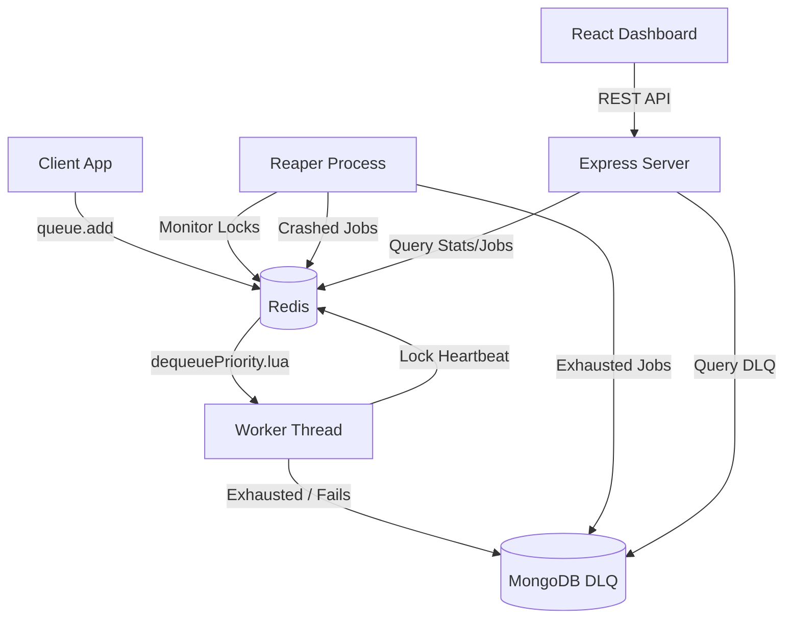

# PulseQueue

PulseQueue is a high-performance, distributed background job processing engine built for Node.js. It leverages Redis for extremely fast, reliable queuing operations (using atomic Lua scripts) and MongoDB for persistence of Dead Letter Queue (DLQ) records and processing history. It also features a built-in React-based dashboard for real-time monitoring and job management.

---

## 🚀 Key Features

- **Priority-Based Queuing:** Classify jobs as `high`, `default`, or `low` priority. Workers execute high-priority jobs first.
- **Delayed & Scheduled Jobs:** Schedule jobs to execute at a precise time or after a specified delay.
- **Atomic Queue Operations:** Uses Lua scripts (`promoteDelayed.lua` & `dequeuePriority.lua`) to guarantee atomic operations and prevent race conditions.
- **Concurrent Processing:** Spawn multiple worker routines concurrently within a single process.
- **Graceful Shutdown:** Workers stop pulling new work and drain active jobs gracefully on exit.
- **Automatic Retries with Backoff:** Retries failing jobs automatically using an exponential backoff strategy with randomized jitter.
- **Stale Job Recovery (Reaper):** Automatically detects crashed/dead workers via expiring locks and requeues orphan jobs.
- **Dead Letter Queue (DLQ):** Relocates jobs that exhaust all retry attempts into MongoDB for manual review.
- **Admin Dashboard:** Real-time dashboard built with React + Vite to visualize queue metrics, inspect job states (waiting, processing, delayed, DLQ), and retry failed jobs.

---

## 🏗️ Architecture



---

## 📂 Project Structure

```text
PulseQueue/
├── benchmark/               # Benchmark scripts (load tests, chaos tests)
├── dashboard/               # Frontend Vite + React application
│   ├── src/                 # Dashboard components (JobTable, StatsBar, DLQView)
│   └── package.json
├── src/
│   ├── api/                 # Express backend API for dashboard
│   ├── lua/                 # Transactional Redis Lua scripts
│   ├── models/              # Mongoose schema for persistent JobRecords
│   ├── queue.js             # Core queue submit & scheduling engine
│   ├── worker.js            # Core job puller, execution, retry logic
│   └── reaper.js            # Crash recovery monitor
├── tests/                   # Jest Integration & Core tests
├── server.js                # Express Server entrypoint
├── index.js                 # Local CLI demo run
├── package.json
└── README.md
```

---

## 🛠️ Prerequisites

- **Node.js** (v18+)
- **Redis Server** (listening on port `6379`)
- **MongoDB** (running locally on port `27017` or configured via `MONGO_URI`)

---

## 📦 Installation & Setup

1. **Clone the repository and install root dependencies:**
   ```bash
   cd PulseQueue
   npm install
   ```

2. **Install dashboard dependencies:**
   ```bash
   cd dashboard
   npm install
   cd ..
   ```

3. **Ensure Redis & MongoDB are running:**
   ```bash
   # If you use Docker:
   docker run -d --name redis -p 6379:6379 redis:alpine
   docker run -d --name mongodb -p 27017:27017 mongo:latest
   ```

---

## 🚦 Running the Project

### 1. Run the local CLI Demo
Execute a self-contained demonstration of job priorities, delays, and worker execution:
```bash
npm start
# Or manually run:
node index.js
```

### 2. Start the API Server & Dashboard (Development Mode)
Start the Express API server and the Vite dashboard simultaneously using:
```bash
npm run dev
```
- **API Server:** runs on `http://localhost:3001`
- **Dashboard UI:** opens on `http://localhost:5173`

---

## 🧪 Testing & Benchmarks

### Running Tests
Execute the Jest integration test suite (requires Redis and MongoDB to be running):
```bash
npm test
```
The test suite validates:
- Core queuing & priority ordering
- Concurrency control & graceful worker shutdown
- Exponential backoff & DLQ routing
- Reaper crash-recovery behavior

### Running Benchmarks
Evaluate performance under load:
```bash
# Run load test (e.g. 20 worker threads, 5000 jobs)
node benchmark/loadtest.js --workers=20 --jobs=5000
```
This generates latency and throughput statistics, saving the report to `benchmark/loadtest_results.json`.
